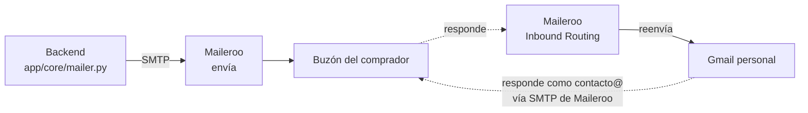

# Correo y DNS

Cómo está montada la entrega de informes: quién envía, quién recibe y qué registros DNS lo
sostienen. Escrito mientras se configuraba, con los errores que aparecieron por el camino.

**Por qué importa más de lo que parece.** El correo no es un accesorio del producto: es la
entrega. Alguien paga 39 € y lo que recibe es un correo. Si acaba en spam, para el cliente
es idéntico a no haberlo enviado, pero ya te ha pagado. Y además es el canal por el que
salen todas las alertas del sistema —pago sin datos válidos, informe fallido, devolución
pendiente, Copernicus caído—, así que sin correo esas alertas son ruido en un log que nadie
lee.

## Las tres piezas



| Pieza | Para qué | Qué registros DNS toca |
|---|---|---|
| **Cloudflare** | Solo DNS de la zona | ninguno propio; aloja los de Maileroo |
| **Maileroo** | Envío **y** recepción (reenvío a Gmail) | TXT (SPF, DKIM, DMARC), MX, CNAME de tracking |
| **Gmail** | Leer y responder con la dirección del dominio | ninguno |

El dominio sigue **registrado en GoDaddy**; Cloudflare solo gestiona el DNS. No hace falta
transferirlo — de hecho el registrador de Cloudflare no admite `.es`.

**Por qué la recepción acabó en Maileroo y no en Cloudflare.** El plan inicial era usar
Email Routing de Cloudflare, y se descartó al ver que Maileroo ya recibe: su Inbound Routing
acepta el correo del dominio y lo reenvía a una dirección externa, hasta cuatro reenviadores
en el plan gratuito. Con una sola pieza haciendo entrada y salida hay menos que mantener, y
—sobre todo— desaparece el riesgo de acabar con dos registros SPF, que es el fallo que más
silenciosamente rompe la entrega. Cloudflare se queda como DNS porque su panel aplica los
cambios en segundos y no inyecta por su cuenta el DMARC en `p=quarantine` que ponía GoDaddy.
Lo que **no** hay que hacer es activar Email Routing: sus MX competirían con los de Maileroo.

## El orden, que no es opcional

Cada fase depende de la anterior. Saltarse el orden es la causa de la mayoría de los
atascos.

### 1 · Recepción antes que envío

Suena al revés, pero Gmail manda un **código de verificación** a la dirección del dominio
para poder enviar como ella. Sin recepción, no hay envío.

1. Cloudflare → **Add a site** (no «Register/Transfer»: no admite `.es`) → plan Free.
2. Importación automática de registros. **Comprobar que sobreviven** los TXT existentes
   —en este caso `google-site-verification`, que sostiene Search Console—.
3. Copiar los dos nameservers asignados y ponerlos en GoDaddy → *DNS* → **Servidores de
   nombres** → «usar mis propios». No son un registro DNS: van en su propia sección.
4. Esperar. Cloudflare avisa de 1-2 horas, hasta 24; en este dominio tardó **78 minutos**
   desde el cambio en GoDaddy hasta que el registro del `.es` delegó en Cloudflare.
5. Maileroo → Domains → añadir `informefinca.es` → **DNS Records**, y copiar a Cloudflare
   los cinco: SPF, DKIM, los dos MX y el CNAME de tracking. Si el dominio ya está en
   Cloudflare, Maileroo lo detecta y ofrece **Authorize Cloudflare** para escribirlos él.
6. **Rescan DNS** hasta que los cinco queden *Verified* y el dominio pase a **Active**.
7. Maileroo → **Inbound Routing** → reenviador `contacto@informefinca.es` → el Gmail
   personal. Es lo que hace posible el paso 10.

**🛑 Comprobar antes de seguir:** mandar un correo a `contacto@informefinca.es` desde otra
cuenta y verlo llegar al Gmail.

### 2 · Credenciales de envío

8. Maileroo → Domains → **SMTP Accounts** → crear con alias `contacto`. Da usuario
   (`contacto@informefinca.es`) y contraseña.
9. Anotar el **límite horario**: las cuentas nuevas empiezan en 30 correos/hora.

### 3 · Gmail

10. Configuración → Cuentas e importación → *Enviar como* → **Añadir otra dirección**:
    `contacto@informefinca.es`, SMTP `smtp.maileroo.com`, puerto 587, TLS, usuario y
    contraseña de la cuenta SMTP.
11. Llega el código de verificación (posible gracias al reenviador de la fase 1). Pegarlo.
12. Marcarla como predeterminada y activar *«Responder desde la misma dirección a la que se
    envió el mensaje»*.

### 4 · Backend

13. `.env`:

```
SMTP_HOST=smtp.maileroo.com
SMTP_PORT=587
SMTP_USER=contacto@informefinca.es
SMTP_PASSWORD=<la de la cuenta SMTP>
SMTP_STARTTLS=true
MAIL_FROM=contacto@informefinca.es
```

14. `docker compose up -d --force-recreate app worker`

---

## Las trampas, todas encontradas por el camino

**Un solo registro SPF.** Es la que más rompe, y la razón de fondo para no repartir el
correo entre dos proveedores. Cada uno pide el suyo —Cloudflare crea uno al activar Email
Routing, Maileroo pide el propio— y si acaban conviviendo dos registros `v=spf1`, **fallan
los dos** y los correos van a spam sin dar ningún error. Aquí no llegó a pasar porque Email
Routing nunca se activó, pero si alguna vez hay que sumar un segundo emisor, se funden en
uno solo:

```
v=spf1 include:_spf.maileroo.com include:<el-otro> ~all
```

Un solo `v=spf1` al principio, un solo `~all` al final, los `include` en medio.

**El selector del DKIM es `mta`, no `maileroo`.** Buscarlo por el nombre del proveedor
—`maileroo._domainkey`, `default`, `s1`— no devuelve nada y parece que falta. Comprobarlo
con el que aparece en el panel:

```bash
dig +short TXT mta._domainkey.informefinca.es
```

**La identidad de Gmail puede quedar a medias y no decirlo.** Al añadir `contacto@` con
SMTP propio, Gmail manda el código de verificación **a través de ese SMTP**: es lo que
demuestra que controlas el servidor de salida. Si las credenciales no quedan bien guardadas,
Gmail no da ningún error —simplemente el código no sale, y el correo no aparece ni en los
logs de Maileroo—. La pista que lo distingue de un fallo de recepción es esa: si el mensaje
no consta en el panel, no es que se pierda al reenviar, es que nunca se envió. La solución
fue **borrar la identidad y volver a añadirla** reintroduciendo usuario y contraseña.

Mientras tanto, la identidad sin verificar deja el correo saliendo de la cuenta de Gmail con
la dirección del dominio solo en el «Responder a». Se detecta mirando la cabecera: si el
`De:` sigue diciendo `…@gmail.com`, no está verificada.

**El panel de Maileroo muestra el DMARC que recomienda, no el que tienes.** Su columna
«Value» pone `p=reject` y el estado *Verified* solo significa que existe **algún** registro
DMARC. Conviene mirar el real antes de darlo por bueno.

**DMARC en `p=quarantine` sin SPF ni DKIM.** GoDaddy inyecta por defecto un DMARC con
`p=quarantine` apuntando a un buzón suyo. Con SPF y DKIM ausentes, ese registro ordena
cuarentenar los correos del propio dominio: el dominio está configurado para que su correo
acabe en spam. Se empieza en `p=none` —observar sin castigar— y se sube a `quarantine`
cuando SPF y DKIM estén verificados y comprobados:

```
v=DMARC1; p=none; rua=mailto:contacto@informefinca.es
```

**GoDaddy retiró el reenvío de correo.** Ya no ofrece forwarding gratuito; empuja a
contratar Microsoft 365. De ahí que la recepción haya que resolverla fuera —aquí, con el
Inbound Routing de Maileroo; también valdrían Cloudflare o ImprovMX—.

**El registrador de Cloudflare no admite `.es`.** El flujo correcto es **Add a site**, que
solo gestiona DNS. El error «cannot be registered» aparece al entrar por el flujo de
registro/transferencia, que es otra cosa.

**Los nameservers no son un registro DNS.** No se añaden como A, CNAME ni TXT: van en la
sección de servidores de nombres del registrador.

**DNSSEC.** Si está activo en el registrador y se cambian los nameservers sin desactivarlo,
el dominio **deja de resolver por completo**. Comprobarlo antes:

```bash
dig +short DS informefinca.es    # si devuelve algo, DNSSEC está activo
```

**`docker compose restart` no relee el `.env`.** Hay que recrear el contenedor:

```bash
docker compose up -d --force-recreate app worker
```

Aplica a todas las credenciales, no solo a las de correo.

**Adjuntos.** El PDF se manda adjunto además del enlace. En base64 engorda un 33 %, así que
un informe de 5,4 MB viajaba como 7,1 MB y superaba el límite de varios proveedores. Se
resolvió pidiendo las ortofotos en **JPEG en vez de PNG** —son fotografías, comprimirlas sin
pérdida era tirar el ancho de banda— y el informe bajó a 0,72 MB. Ver `IMAGE_FORMAT` en
[app/datasources/ign.py](app/datasources/ign.py).

## Comprobar desde fuera

Los cinco fallos que mandan un correo a spam sin dar error se ven en un minuto:

```bash
dig +short NS informefinca.es                      # ¿manda Cloudflare ya?
dig +short MX informefinca.es                      # ¿hay recepción? (mx1/mx2.maileroo.com)
dig +short TXT informefinca.es | grep spf          # ¿UN solo SPF?
dig +short TXT mta._domainkey.informefinca.es      # ¿está el DKIM? (selector «mta»)
dig +short TXT _dmarc.informefinca.es              # ¿coherente con lo anterior?
```

Mientras los nameservers propagan, se puede preguntar directamente a los de Cloudflare para
ver la configuración real sin esperar a la caché:

```bash
dig +short TXT _dmarc.informefinca.es @kai.ns.cloudflare.com
```

## Por qué Maileroo

Se compararon tres. Los tres valen; las diferencias que importaban:

| | Maileroo | Brevo | Resend |
|---|---|---|---|
| Gratis | 3.000/mes | ~9.000/mes | 3.000/mes (100/día) |
| Límite de mensaje | 24 MB | 4 MB por fichero | 40 MB |
| IP dedicada | **incluida** | de pago | de pago |
| Servidores | **Alemania y Países Bajos** | Francia | EE. UU. |

La IP dedicada gratuita es lo único de esa tabla que compra entregabilidad de verdad. La
sede social de Maileroo es australiana, pero **los servidores están en el EEE**, así que el
tratamiento ocurre dentro de la Unión; tienen DPA con cláusulas contractuales tipo, que hay
que aceptar y mencionar en la política de privacidad como a cualquier otro encargado.

**Límite horario:** las cuentas nuevas empiezan en **30 correos/hora** y sube solo con
historial. No está publicado, se ve en el panel.

## Sin bloqueo de proveedor

[app/core/mailer.py](app/core/mailer.py) habla **SMTP a secas**. Cambiar de proveedor son
cuatro variables del `.env`, sin tocar código. Esa fue la razón de no usar la API propia de
ningún servicio.

## Estado

El correo funciona en las dos direcciones. Hecho:

- Nameservers delegados en Cloudflare (78 min desde el cambio en GoDaddy).
- Los cinco registros *Verified* en Maileroo —SPF, DKIM, los dos MX y el CNAME de
  tracking— y el dominio en **Active**.
- Reenviador `contacto@informefinca.es` → Gmail en **Inbound Routing**, comprobado con
  correos de prueba y con los informes agregados de DMARC que manda google.com.
- Identidad `contacto@informefinca.es` verificada en Gmail, saliendo por el SMTP de
  Maileroo.

Pendiente:

- Rellenar el bloque SMTP del `.env` y recrear los contenedores.
- Prueba de envío real: generar un informe y verificar que llega, que no cae en spam y que
  el adjunto pasa.
- Subir el DMARC a `p=quarantine` **después** de esa prueba, y solo entonces plantearse
  `p=reject`. Saltar directamente a `reject` con algo mal configurado no manda el correo a
  spam: hace que el servidor del destinatario lo rechace, sin aviso y sin recuperación.
- Decidir el **catch-all**: cualquier dirección que no sea `contacto@` se descarta sin dejar
  rastro. Si se publica otra dirección en algún sitio, se perdería.
