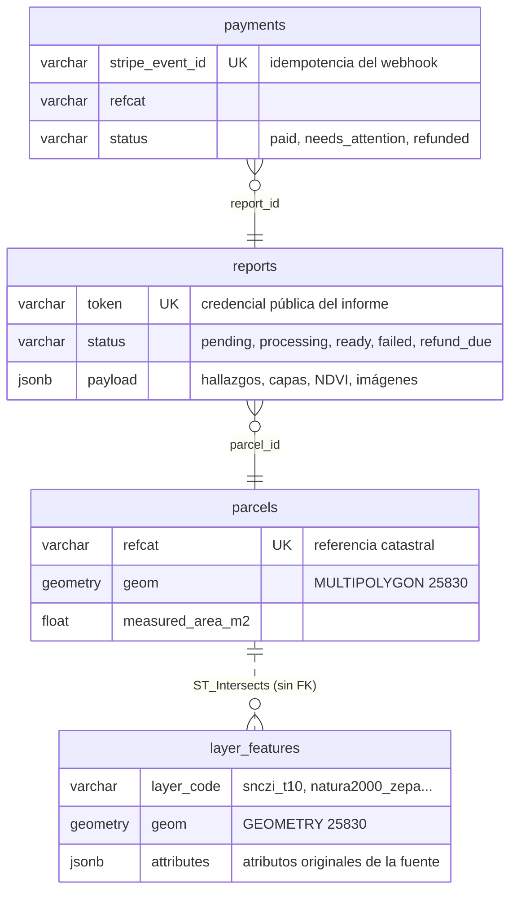

# Modelo de datos

Qué hay en la base de datos de informefinca.es, tabla por tabla, y de dónde sale cada
dato. Escrito a partir de la introspección de una base cargada, no de los modelos: los
tamaños y recuentos son reales.

PostgreSQL 16 + PostGIS 3.4. Cuatro tablas de negocio y ninguna más — no hay cuentas de
usuario, ni sesiones, ni panel: el MVP no los tiene y el SPEC lo prohíbe explícitamente.

## Las dos mitades

La base de datos hace dos trabajos que conviene no confundir:

**Datos transaccionales** — lo que pasa con un pedido concreto: `payments` → `reports` →
`parcels`. Crecen con las ventas, ocupan kilobytes y se consultan por clave.

**Datos de referencia** — `layer_features`: cartografía oficial de toda España cargada en
bloque, que no cambia con las ventas y ocupa gigabytes. Se consulta por geometría.



`parcels` y `layer_features` no tienen relación declarada a propósito: la relación es
espacial y la resuelve PostGIS con `ST_Intersects` en el momento de la consulta.

## Convenciones que aplican a todo

**SRID 25830** (ETRS89 / UTM 30N) en todas las geometrías. Es métrico, así que superficies,
longitudes y distancias las calcula la base de datos en metros reales, sin aproximaciones.
Lo que llega en EPSG:4326 —la geometría del WFS del Catastro, las coordenadas de un
usuario— se reproyecta al entrar, nunca al consultar.

**Geometrías 2D.** La Z se descarta al cargar (`ST_Force2D`). Además de que la columna es
2D, `ST_Length` sobre una línea 3D mide la longitud inclinada, no la que cruza la parcela.

**Timestamps sin zona**, siempre en UTC. La conversión a hora local es cosa de la capa de
presentación.

**JSONB para lo que la fuente decide.** Tres columnas lo usan (`parcels.subplots`,
`layer_features.attributes`, `reports.payload`) y todas por la misma razón: el esquema lo
fija un tercero y cambia sin avisar. Meter esos campos como columnas obligaría a una
migración cada vez que el MITECO añade un atributo.

---

## `parcels` — la parcela catastral

Caché local de lo que el Catastro responde sobre una referencia. Se rellena la primera vez
que alguien la consulta y se refresca a los 30 días (`PARCEL_CACHE_DAYS`).

Existe por dos motivos: el OVC del Catastro no documenta sus límites de uso y la vista
previa es un endpoint público —cachear protege el acceso al OVC, que es lo que pararía el
producto si se pierde—; y cada parcela consultada es una URL indexable, que es el motor
SEO de la Fase 1.

| Columna | Tipo | Qué es |
|---|---|---|
| `id` | integer PK | |
| `refcat` | varchar(20) **UNIQUE** | Referencia catastral, 14 o 20 caracteres |
| `municipality` | varchar(120) | Municipio (`nm` del OVC) |
| `province` | varchar(120) | Provincia (`np`) |
| `use` | varchar(120) | Uso catastral (`luso` o `cn`) |
| `cadastral_area_m2` | float | Superficie **declarada** por el Catastro |
| `built_area_m2` | float | Superficie construida declarada (`sfc`) |
| `measured_area_m2` | float | Superficie **medida** por PostGIS sobre la geometría INSPIRE |
| `subplots` | jsonb | Subparcelas de cultivo |
| `lat`, `lon` | float | Centroide en WGS84, para PVGIS y los WMS |
| `geom` | geometry(MultiPolygon, 25830) | Geometría INSPIRE reproyectada |
| `refreshed_at` | timestamp | Última consulta al Catastro; gobierna la caducidad |

La pareja `cadastral_area_m2` / `measured_area_m2` es el primer hallazgo de todo informe:
lo declarado frente a lo medido. Por encima del 5 % de diferencia se marca como
OBSERVACIÓN, porque afecta al precio por hectárea pactado.

`subplots` es una lista de objetos con la forma:

```json
[{ "crop": "MONTE BAJO", "intensity": "07", "area_m2": 1269480.0 }]
```

**Índices:** `refcat` (btree, único) para la búsqueda por referencia; `geom` (GiST) para
las intersecciones.

---

## `layer_features` — la cartografía de referencia

Una sola tabla para todas las capas oficiales, no una por fuente. Así una única consulta
`ST_Intersects` responde a todas las afecciones, y añadir SIGPAC más adelante es un trabajo
de carga y no una migración.

| Columna | Tipo | Qué es |
|---|---|---|
| `id` | integer PK | |
| `layer_code` | varchar(64) | Qué capa es: `snczi_t10`, `natura2000_zepa`… |
| `name` | varchar(255) | Nombre oficial del elemento, para poder citarlo |
| `attributes` | jsonb | Todos los atributos originales del shapefile |
| `geom` | geometry(**Geometry**, 25830) | Polígono o línea, según la capa |

La columna es `Geometry` genérica y no `MultiPolygon` porque las vías pecuarias se publican
como **ejes** (líneas). Una columna solo de polígonos rechazaría justo la capa cuyo interés
es que *cruza* la parcela. De ahí que la medida dependa del tipo: los polígonos se miden
por área (`ST_Area`) y las líneas por longitud (`ST_Length`) — `ST_Area` de una línea es
cero, que se leería como «sin afección».

**Índices:** `geom` (GiST), `layer_code` (btree) y el compuesto `(layer_code, geom)` (GiST,
que necesita la extensión `btree_gist` para mezclar un texto con una geometría).

### Qué capas hay y qué trae cada una

El catálogo vive en [app/layers/catalog.py](app/layers/catalog.py); esto es lo que hay
cargado y las claves reales de su `attributes`.

| `layer_code` | Fuente | Geometría | Qué significa una intersección |
|---|---|---|---|
| `snczi_t10` | SNCZI · MITECO | polígonos | Zona inundable con periodo de retorno 10 años |
| `snczi_t100` | SNCZI · MITECO | polígonos | Periodo de retorno 100 años |
| `snczi_t500` | SNCZI · MITECO | polígonos | Periodo de retorno 500 años |
| `snczi_zfp` | SNCZI · MITECO | polígonos | Zona de Flujo Preferente — **INCIDENCIA**: bloquea |
| `natura2000_zepa` | BDN · MITECO | polígonos | ZEPA (Directiva Aves) |
| `natura2000_zec` | BDN · MITECO | polígonos | ZEC/LIC (Directiva Hábitats) |
| `enp` | BDN · MITECO | polígonos | Espacio Natural Protegido |
| `montes_up` | Comunidad autónoma | polígonos | Monte de Utilidad Pública — dominio público |
| `vias_pecuarias` | RGVP · MITECO | **líneas** | Eje de vía pecuaria — dominio público |

Un espacio Natura 2000 puede ser ZEPA y ZEC a la vez (`tipo = 'C'` en origen), así que
cuenta en las dos capas. No es un duplicado: son dos figuras de protección distintas sobre
el mismo terreno.

#### Atributos por capa

Lo que sobrevive en `attributes`, tal cual lo publica cada organismo:

**`snczi_t10` / `snczi_t100` / `snczi_t500`** — `name` se rellena con `rio`.
`ciclo`, `clave_expe`, `demarcacio`, `documento`, `estudio`, `fecha_apro`, `fecha_geo`,
`fecha_lim`, `hidraul`, `hidrologia`, `hipotesis`, `id_demar`, `id_zona`, `long_km`,
`organismo`, `precision`, `q_m3_s`, `rio`, `shape_area`, `shape_le_1`, `shape_leng`,
`tipo_est`, `tipo_zona`, `zi_directi`, `zona`.
Interesan sobre todo `rio` (el cauce), `q_m3_s` (caudal de la hipótesis), `organismo` (la
confederación competente) y `fecha_apro` (cuándo se aprobó el estudio).

**`natura2000_zepa` / `natura2000_zec`**
`site_code` (código oficial europeo, tipo `ES0000369`), `site_name`, `tipo` (A/B/C),
`hectareas`, `ac` (comunidad autónoma).

**`enp`**
`site_code_`, `site_name`, `site_cdda` (código europeo CDDA), `desig_abbr` (figura: parque
natural, reserva…), `odesignate`, `sup_ha`, `nut2`, `shape_area`, `shape_leng`.

**`vias_pecuarias`**
`nb_via` (nombre real de la vía), `cd_tipo_vp` (**tipo: `CA` cañada, `COR` cordel, `VE`
vereda**), `cd_est_vp` (estado), `fc_clasif` (fecha de clasificación), `nm_long`,
`id_cod_vp`, `nombre` (**ojo: es el municipio, no la vía**), `pro_n_ine`, `nut2_nom`,
`nut3_nom`, `codigo_ine`, `ds_obs`.

`cd_tipo_vp` es el dato con el que se podría decir la anchura legal concreta (cañada hasta
75 m, cordel 37,5 m, vereda 20 m) en vez de recitar las tres. Está cargado y sin usar.

### Tamaños reales

Mídelos en cualquier momento con `make layers-size`. Cifras del día en que se escribió
esto, con las capas de biodiversidad terminadas y las de inundabilidad todavía cargándose:

| Capa | Filas | Geometrías | Estado |
|---|---:|---:|---|
| `snczi_t10` | 609.308 | 1.451 MB | completa |
| `natura2000_zec` | 1.479 | 156 MB | completa |
| `enp` | 1.785 | 83 MB | completa |
| `natura2000_zepa` | 659 | 80 MB | completa |
| `vias_pecuarias` | 51.939 | 48 MB | completa |
| `snczi_t100`, `snczi_t500` | — | — | en carga |

Las láminas de inundabilidad tienen tantísimas más filas porque se cargan troceadas con
`ST_Subdivide` a 512 vértices: un polígono que sigue un cauce durante kilómetros tiene un
*bounding box* enorme comparado con su superficie, y sin trocear el índice GiST devolvería
candidatos en media provincia. Ese troceo es también el motivo de que `GeometryType` sea
`POLYGON` en las capas SNCZI y `MULTIPOLYGON` en las demás: cada trozo es un polígono
suelto.

Las capas de espacios protegidos no se trocean: cada polígono ya es un espacio acotado y
subdividirlo cuesta mucho más de lo que ahorra —uno de 149.651 vértices tardaba más de once
minutos—. Por eso `subdivide` es un ajuste por capa y no una regla general.

### Tablas `staging_*`

Transitorias. `ogr2ogr` vuelca ahí el shapefile tal cual, con sus columnas originales, y el
cargador las normaliza a `layer_features` y las borra. Si ves una `staging_*` en la base es
que una carga se interrumpió: se puede borrar sin miedo.

---

## `reports` — el informe

Un pedido pagado y su ciclo de vida.

| Columna | Tipo | Qué es |
|---|---|---|
| `id` | integer PK | |
| `token` | varchar(64) **UNIQUE** | 24 bytes aleatorios: la credencial pública |
| `refcat` | varchar(20) | Parcela pedida |
| `email` | varchar(255) | Correo de entrega |
| `parcel_id` | integer FK → `parcels` | Se rellena al generarlo |
| `status` | varchar(20) | Ver abajo |
| `payload` | jsonb | Todo lo que recopiló el pipeline |
| `pdf_path` | varchar(512) | Ruta del PDF en el volumen |
| `error` | text | Motivo del fallo |
| `generated_at`, `delivered_at` | timestamp | Cuándo se generó y cuándo se envió |

**El `token` es la única credencial.** No hay cuentas: quien tiene el enlace tiene el
informe. Por eso son 24 bytes aleatorios y no un id incremental.

**Estados:**

| Estado | Significado |
|---|---|
| `pending` | Pago cobrado, en cola |
| `processing` | El worker está recopilando datos |
| `ready` | PDF disponible |
| `failed` | Falló tras los reintentos; avisa a operaciones |
| `refund_due` | La parcela no se puede procesar (catastro foral, sin geometría). **La web promete devolución íntegra**, así que es un estado que exige acción humana |

`payload` guarda el resultado completo del pipeline —hallazgos con severidad y confianza,
capas intersectadas, serie NDVI, ortofotos en base64, recomendaciones y fuentes— para poder
volver a renderizar el PDF sin pedir nada otra vez a los servicios públicos. Es la columna
que más crece: un informe con ortofotos ronda los pocos MB.

---

## `payments` — el cobro

| Columna | Tipo | Qué es |
|---|---|---|
| `id` | integer PK | |
| `stripe_event_id` | varchar(120) **UNIQUE** | Idempotencia del webhook |
| `stripe_session_id` | varchar(120) | Sesión de Checkout |
| `stripe_payment_intent` | varchar(120) | Necesario para devolver |
| `refcat`, `email` | varchar | Lo que traía el pago |
| `amount_cents` | integer | En céntimos, nunca en float |
| `currency` | varchar(8) | `eur` |
| `status` | varchar(20) | `paid`, `needs_attention`, `refunded` |
| `report_id` | integer FK → `reports` | El informe que generó |
| `note` | text | Por qué necesita intervención |
| `raw_event` | jsonb | Rastro de auditoría |

**El índice único sobre `stripe_event_id` es lo que hace idempotente el webhook.** Stripe
reintenta hasta recibir un 2xx, y un reintento no puede cobrar ni generar un segundo
informe.

`needs_attention` es un pago cobrado cuya referencia catastral o correo no sirven. Nunca se
descarta en silencio: se guarda con el motivo y se avisa por correo, porque un pedido
pagado que no se puede atender es el peor fallo posible del sistema.

---

## Lo que NO está en la base de datos

- **Los PDF**, que viven en el volumen `reports_data` (`REPORTS_DIR`). La base solo guarda
  la ruta.
- **La cola de trabajos**, que es Redis (Celery). Si Redis se vacía, los informes en
  `pending` se quedan ahí y hay que reencolarlos.
- **Las claves de Stripe y SMTP**, en `.env`.

## Extensiones instaladas

`postgis` y `btree_gist` son nuestras. `postgis_topology`, `postgis_tiger_geocoder` y
`fuzzystrmatch` las instala la imagen de Docker y no las usamos — pero importan, porque
ponen sus esquemas en el `search_path` y un `alembic revision --autogenerate` ingenuo
propondría borrar sus 36 tablas. Por eso `alembic/env.py` pregunta a `pg_depend` qué
pertenece a una extensión y lo excluye.

## Cómo se puebla cada tabla

| Tabla | Quién escribe | Cuándo |
|---|---|---|
| `parcels` | `ParcelService.get_or_fetch` | Vista previa o generación de informe, con caché de 30 días |
| `layer_features` | `scripts/fetch_layers.py`, `scripts/load_layers.sh` | Carga manual, una o dos veces al año |
| `payments` | Webhook de Stripe | Al confirmarse un pago |
| `reports` | `PaymentService` lo crea, la tarea Celery lo completa | Tras el pago |
