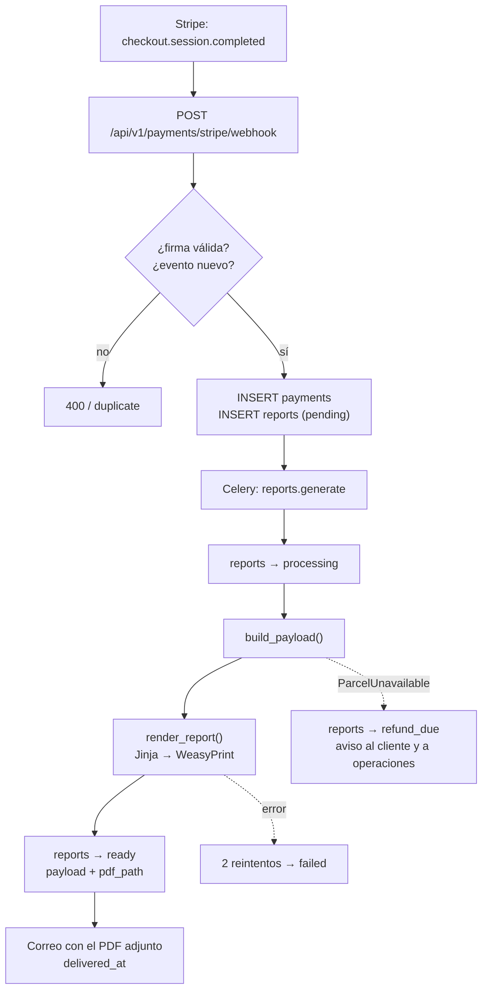

# El pipeline del informe

Qué pasa entre que alguien paga 39 € y recibe un PDF: qué se consulta, a quién, qué tablas
se tocan, cómo se decide lo que dice el informe y qué sale al final.

El modelo de datos está en [MODELO-DATOS.md](MODELO-DATOS.md).

## El recorrido completo



El webhook responde en milisegundos: solo escribe dos filas y encola. Todo lo caro ocurre
en el worker, porque hacer esperar a Stripe solo consigue que reintente.

---

## Fase 1 · Recopilación (`app/reports/pipeline.py`)

`build_payload()` es lo único que decide **qué datos entran** en el informe. Devuelve un
diccionario serializable a JSON que se guarda entero en `reports.payload`, para poder
volver a renderizar el PDF sin molestar otra vez a los servicios públicos.

### 1.1 La parcela — Catastro

`ParcelService.get_or_fetch(refcat)`

| | |
|---|---|
| **Tabla** | `parcels` — lectura, y escritura si falta o caducó (30 días) |
| **Fuente externa** | OVC del Catastro (`Consulta_DNPRC`) y WFS INSPIRE (`GetParcel`) |
| **Saca** | municipio, provincia, uso, superficie declarada, superficie construida, subparcelas de cultivo y la geometría de la parcela |

La geometría llega en EPSG:4326 y se reproyecta a 25830 **dentro de la base de datos**:

```sql
UPDATE parcels SET geom = ST_Multi(ST_Transform(ST_GeomFromText(:wkt, 4326), 25830));
SELECT ST_Area(geom) FROM parcels WHERE id = :parcel_id;   -- → measured_area_m2
```

De ahí sale `measured_area_m2`: metros cuadrados reales calculados por PostGIS, no la
aproximación plana que hacía el PoC. La comparación con lo declarado es el primer hallazgo
de todo informe.

Si el Catastro no reconoce la referencia —catastros forales de País Vasco y Navarra, o
referencias sin geometría publicada— se lanza `ParcelUnavailable` y **el pipeline se para
aquí**: el informe pasa a `refund_due` y se devuelve el importe.

### 1.2 Las afecciones — PostGIS

`LayerService.hits_for_parcel(parcel_id, area)` recorre el catálogo de capas y, para cada
una, hace tres preguntas contra `layer_features`:

**¿Está cargada esta capa para esta zona?**

```sql
SELECT EXISTS (
  SELECT 1 FROM layer_features f JOIN parcels p ON p.id = :parcel_id
  WHERE f.layer_code = :layer_code AND ST_DWithin(f.geom, p.geom, 50000)
);
```

Se mide contra la geometría de la parcela, no contra coordenadas sueltas: una parcela sin
lat/lon poblados se comprobaría alrededor del punto (0, 0) y todas las capas parecerían no
cargadas. Las capas que no superan esta comprobación **no se presentan como «sin
afección»**: salen como salvedad explícita en el informe.

**¿Intersecta?**

```sql
SELECT COALESCE(SUM(ST_Area(ST_Intersection(f.geom, p.geom))), 0),
       ARRAY_AGG(DISTINCT f.name) FILTER (WHERE f.name IS NOT NULL)
FROM layer_features f JOIN parcels p ON p.id = :parcel_id
WHERE f.layer_code = :layer_code AND ST_Intersects(f.geom, p.geom);
```

`ST_Area` para capas de polígonos y **`ST_Length` para las de líneas** (vías pecuarias):
el área de una línea es cero, que se leería como «sin afección» justo en la capa de dominio
público.

**Si no intersecta, ¿qué hay cerca?** Solo para las capas donde la proximidad condiciona
permisos (Red Natura, ENP, vías pecuarias), con el operador KNN y un radio de 10 km:

```sql
SELECT f.name, ST_Distance(f.geom, p.geom)
FROM layer_features f JOIN parcels p ON p.id = :parcel_id
WHERE f.layer_code = :layer_code AND ST_DWithin(f.geom, p.geom, 10000)
ORDER BY f.geom <-> p.geom LIMIT 1;
```

De ahí sale la frase «el espacio más próximo, «Riberas del Río Órbigo y afluentes», está a
8,9 km».

### 1.3 Los tres servicios externos, en paralelo

```python
orthophotos, solar, ndvi = await asyncio.gather(
    ign.fetch_time_series(geometry),  # WMS del IGN
    pvgis.fetch_solar_potential(lat, lon),  # PVGIS (JRC)
    copernicus.fetch_ndvi_series(geometry),  # Sentinel-2
)
```

| Servicio | Qué saca | Si falla |
|---|---|---|
| **IGN WMS** | Ortofoto PNOA actual + cada vuelo histórico disponible (1956→hoy), en PNG base64 | Se omite la sección multitemporal |
| **PVGIS** | kWh/kWp·año e inclinación óptima | Se omite el apartado de potencial |
| **Copernicus** | Serie NDVI mensual de 8 años | Se omite; sin credenciales CDSE ni se intenta |

Ninguno puede tumbar el informe: cada cliente degrada a `None` o lista vacía por su cuenta.
Van concurrentes porque son independientes y el más lento manda.

**Nada de esto toca la base de datos**: son llamadas HTTP cuyo resultado acaba en el
`payload`.

---

## Fase 2 · Interpretación (`app/reports/findings.py`)

Aquí está el producto. Funciones puras sobre datos planos —sin base de datos, sin red— y
por eso testeables: [tests/reports/test_findings.py](tests/reports/test_findings.py)
comprueba la *redacción*, no el formato.

Cada hallazgo lleva **severidad** y **confianza**, nunca un score:

| Severidad | Cuándo |
|---|---|
| `INCIDENCIA` | Zona de Flujo Preferente o dominio público: para una compra |
| `AFECCIÓN` | Intersección con una capa que condiciona usos |
| `OBSERVACIÓN` | Discrepancia o señal que exige verificación |
| `CONFORME` | Comprobado y sin problema |

| Confianza | Significa |
|---|---|
| `ALTA` | Dato leído directamente de una fuente oficial |
| `MEDIA` | Inferencia. Se redacta como tal: «compatible con», «requiere verificación» |

Qué genera cada regla:

| Función | De dónde | Produce |
|---|---|---|
| `area_finding` | `parcels` | Declarada vs medida; OBSERVACIÓN si supera el 5 % |
| `layer_findings` | `layer_features` | Una por capa: intersección o ausencia, con nombre y superficie |
| `built_area_finding` | `parcels.built_area_m2` | Señala la **pregunta**, nunca la respuesta (ver abajo) |
| `ndvi_finding` | Sentinel-2 | Actividad vegetal del último año, siempre confianza MEDIA |
| `solar_finding` | PVGIS | Aptitud fotovoltaica, advirtiendo que no implica viabilidad |
| `coverage_caveats` | cobertura de capas | Qué **no** se ha podido comprobar |
| `build_dictamen` | los hallazgos | El veredicto de cabecera |
| `recommendations` | los hallazgos | Actuaciones concretas antes de firmar |

Tres reglas que el código respeta y conviene no romper:

**No se detectan edificaciones automáticamente.** El informe pone la superficie construida
declarada junto a la serie de ortofotos y señala la discrepancia como algo a comprobar
visualmente. Afirmar una detección que no hemos hecho sería exactamente lo que este
producto critica de la competencia.

**El NDVI nunca afirma abandono.** Un barbecho prolongado produce la misma señal, y el
texto lo dice explícitamente.

**Una capa sin cargar es una salvedad, no un «sin afección».** El silencio no es un
resultado limpio.

Los hallazgos se ordenan por severidad (INCIDENCIA → AFECCIÓN → OBSERVACIÓN → CONFORME)
antes de renderizar, para que el resumen ejecutivo empiece por lo que importa.

---

## Fase 3 · Renderizado (`app/reports/renderer.py`)

`payload` → Jinja2 ([app/reports/templates/report.html.j2](app/reports/templates/report.html.j2))
→ HTML → WeasyPrint → PDF A4.

- Sin fuentes remotas: el worker no tiene por qué salir a internet a mitad de render, y una
  webfont que no carga reflowaría un documento pensado para ser citable.
- La gráfica NDVI se calcula en Python (`ndvi_chart`) y se dibuja como SVG inline; la
  plantilla no hace aritmética.
- Las ortofotos van embebidas como data-URI base64.
- El render corre en un hilo aparte (`asyncio.to_thread`) porque bloquea.

---

## Fase 4 · Entrega (`app/reports/tasks.py`)

1. `reports` → `ready`, con `payload`, `pdf_path`, `generated_at` y `parcel_id`.
2. Correo al comprador con el enlace de descarga y el PDF adjunto.
3. Si el correo sale, `delivered_at`.

El PDF queda en el volumen `reports_data`; la base solo guarda la ruta.

---

## Qué toca cada tabla

| Tabla | Lee | Escribe |
|---|---|---|
| `payments` | idempotencia por `stripe_event_id` | la fila del cobro |
| `reports` | el pedido a generar | estado, `payload`, `pdf_path`, fechas, `error` |
| `parcels` | caché de la parcela | la parcela si falta o caducó, y `measured_area_m2` |
| `layer_features` | intersecciones, distancias y cobertura | **nunca** — es solo lectura |

---

## Cuando algo falla

| Situación | Estado | Qué pasa |
|---|---|---|
| Parcela imposible (foral, sin geometría) | `refund_due` | No se reintenta. Correo al cliente y aviso a operaciones para devolver |
| Un servicio externo caído | `ready` | El informe sale sin esa sección, y lo dice |
| Capa no cargada para la zona | `ready` | Sale como salvedad explícita |
| Error inesperado | 2 reintentos → `failed` | Aviso a operaciones |
| Tiempo agotado (15 min) | `failed` | Aviso a operaciones |
| El worker repite un informe ya `ready` | — | Se salta: la tarea es idempotente |

---

## El resultado

Un PDF A4 con esta estructura, en este orden:

1. **Cabecera y dictamen** — referencia, municipio, centroide, número de informe y el
   veredicto: «Sin incidencias detectadas», «Apta con salvedades» o «Requiere aclaración
   previa».
2. **Resumen ejecutivo** — tabla de hallazgos con severidad, texto, fuente y confianza. Más
   las salvedades de lo no comprobado.
3. **Identificación** — datos catastrales y el contraste de superficies.
4. **Aprovechamiento** — subparcelas de cultivo y la serie NDVI con su interpretación.
5. **Análisis multitemporal** — ortofotos 1956→hoy y su valor probatorio.
6. **Afecciones** — tabla por capa con la superficie o longitud afectada.
7. **Potencial** — indicadores fotovoltaicos.
8. **Recomendaciones** — actuaciones previas a la transmisión.
9. **Pie** — metodología, fuentes citadas según su licencia, alcance y limitaciones.

Y en la base, `reports.payload` con exactamente los mismos datos en JSON, que permite
regenerar el PDF si cambia la plantilla sin volver a consultar nada.

Para ver la pinta que tiene sin red ni base de datos:

```bash
uv run python scripts/demo_report.py --out demo.html --pdf demo.pdf
```
